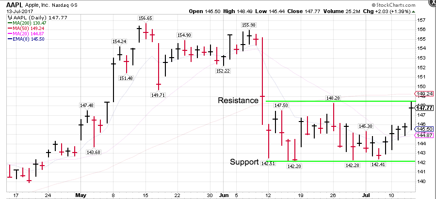
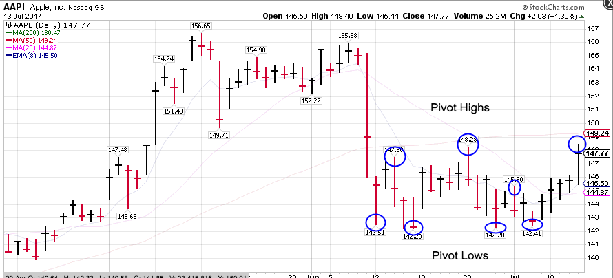

# nodeVSA

nodeVSA is a tool that retrieves a set of daily stock data for a list of your tickers, cleans and transforms it, and scans for pivots that have prior pivots within range.

nodeVSA consumes data from the free [Alpha Vantage](https://www.alphavantage.co/) stock data API.

## Overview

In stock trading, **support** and **resistance** refer to price levels that represent invisible floors and ceilings.

The stock price tends to resist falling below a support level, or rising above a resistance level.

For example, here's a current chart for AAPL:

Notice how the price is trading within a **channel**, a range formed between a support and a resistance level.

You can detect the strength of a support/resistance level by observing how many unsuccessful attempts are made to break through it. With four unsuccessful attempts to break below, this support level looks pretty strong.

A **pivot** is a day that has an outlying high or low:

Pivots represent a short-term change in trading direction. nodeVSA detects pivots and scans for prior pivots close to the same price. 

While it can be informative to see what the price has historically done at the current level overall, recent pivots (within the last 10 trading days) carry more weight.

You can detect when buying or selling pressure has been depleted by what happens to the trading volume as the price revisits a support/resistance level. If a stock price revisits a support/resistance level but on lower volume each time, this can signal that the stock is ready to change directions.

Let's take a look at what the volume is doing on each of these pivot lows.

Notice that the volume decreases on each subsequent pivot low. This tells us that the selling pressure (the interest in selling) at that price is decreasing. By the last pivot low it appears to have dried up. This means that the stock may be ready for a turnaround, and this looks like a good time to buy.

nodeVSA helps you find these trading setups by identifying the number of prior pivots at the same level as the current pivot.

## Installation:

To set up nodeVSA:

1. Run `git clone https://github.com/wnmurphy/nodeVSA.git`

2. Run `npm install` to install dependencies.

3. Visit [Alpha Vantage](https://www.alphavantage.co/support/#api-key) and get an API key.

4. Create a `config.js` file in the root directory, containing `module.exports = { API_KEY : YOUR_API_KEY};`

5. Add your own stock tickers to `stockList.js`.

6. Run `node nodeVSA`.

## Throttling:

At Alpha Vantage's request, server requests are throttled at a rate of ~200/minute. You can modify this in `createThrottle.js` but with large stock ticker lists you run the risk of `HTTP 503` errors when their server gets angry.

`createThrottle` takes two numbers as arguments: `series` and `timeout`.

`series` represents the number of requests to send in a batch. `timeout` represents the number of milliseconds to wait between request batches.

By default assignment in the method signature, `series` gets 10 and `timeout` gets 1000ms, meaning that 10 requests will be sent every second.

In the actual method call, `series` is set to 3 and `timeout` is set to 1000ms, meaning that a batch of 3 request is sent every second.  3 requests per second is 180 requests per minute, which keeps us below the server throttle of 200/minute.

## Filtering Results

You can filter search results by adding your search criteria as a command line argument:

  `node nodeVSA {search criteria as a string}`

The available search critera are:

- `signal.date`: `'YYYY-MM-YY'`
- `signal.trade`: `'long' | 'short'`
- `signal.symbol`: `'TSLA'`, etc.
- `signal.hitsCount`: `> 0`, etc.
- `signal.recentHitsCount`: `> 0`, etc.
- `signal.recentHitsOnLowerVolumeCount`: `> 0`, etc.

For example, to show only results for long trades for Apple (AAPL), run:

  `node nodeVSA "signal.trade === 'long' && signal.symbol === 'AAPL'"`

To show only results after a certain date, run:
  
  `node nodeVSA "signal.date > '2017-07-01'"`

`hitsCount` is the number of prior pivots in the data set within 0.3% (three-tenths of a percent) of a pivot.

`recentHitsCount` is the number of hits within the last month, which are more relevant.

The signal object looks like:

~~~javascript
{
  date: "06-25-17",
  symbol: "AAPL",
  hitsCount: 2,
  hits: [{}, {}],
  recentHitsCount: 1,
  recentHits: [{}],
  recentHitsOnLowerVolumeCount: 1,
  recentHitsOnLowerVolume: [{}],
  direction: "short"
}
~~~

`{}` is shorthand for a trading day object, below.

The signal object also exposes data for the trading day these hits were generated: `signal.hits` and `signal.recentHits` are arrays of trading day objects. This is useful for comparing volume between the current day, and prior days with a pivot in the same price range.

A trading day object looks like:

~~~javascript
{
   date : "2017-03-09",
   h : 9.59,
   l : 9.27,
   c : 9.46,
   v : 2931317,
   pivotHigh : true,
   pivotLow : false,
   hits: [{}],
   hitsCount: 1
 }
~~~

## Changing the Time Series of the Data

nodeVSA is written to analyze stock data on a daily time series, but supports other intervals as well.

The [Alpha Vantage API](https://www.alphavantage.co/documentation) provides the following time series options:

- [Intraday](https://www.alphavantage.co/documentation/#intraday) (at 1min, 5min, 15min, 30min, 60min intervals)
- [Daily](https://www.alphavantage.co/documentation/#daily) (nodeVSA default)
- [Daily Adjusted](https://www.alphavantage.co/documentation/#dailyadj) (returns additional fields like dividend amount)
- [Weekly](https://www.alphavantage.co/documentation/#weekly)
- [Monthly](https://www.alphavantage.co/documentation/#monthly)

To modify the time series, alter the `function` parameter in the query string sent to Alpha Vantage on each request. This is in `src/fetchDataForOneStock.js`, in the param hash passed to the call to `RP`.

Change the value for the `function` key to:

- `"TIME_SERIES_INTRADAY"`
- `"TIME_SERIES_DAILY"`
- `"TIME_SERIES_DAILY_ADJUSTED"`
- `"TIME_SERIES_WEEKLY"`
- `"TIME_SERIES_MONTHLY"`

If you set the time series to `TIME_SERIES_INTRADAY`, you'll need to add the `interval` property to the param hash, and set it equal to one of the following:

- `"1min"`
- `"5min"`
- `"15min"`
- `"30min"`
- `"60min"`

## Output to CSV File

Search results are written to `results.csv` in the root directory on every run, so you can load results into Excel or another tool for more advanced analysis.

Fields are comma-separated, and results are newline-separated.

This file is overwritten each time you run nodeVSA.

## Resources

To learn more about volume analysis at pivot points, check out the following:

- [*Master the Markets*](https://www.tradeguider.com/mtm_251058.pdf) by Tom Williams
- [*Trades About to Happen*](https://www.amazon.com/gp/product/0470487801/) by David H. Weis